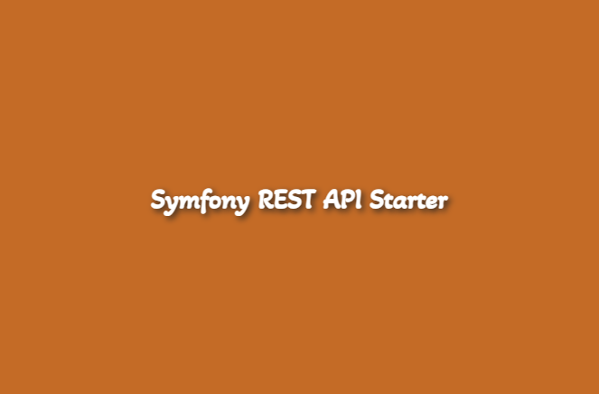

# Symfony REST API Starter

  <b>A comprehensive starter kit for building RESTful APIs using Symfony.</b>

  
  

---

## Features

| Feature           | Description                                                                                            |
|-------------------|--------------------------------------------------------------------------------------------------------|
| **Authentication**     | Login, register, password change request, and password change with JWT-based authentication.               |
| **User Management**     | CRUD operations on the "User" entity with automatic password hashing.                                        |
| **Article Management**  | CRUD operations on the "Article" entity with file upload support.                                           |
| **Request Validation**  | Validate request bodies and query parameters, including allowed, disallowed, and required fields.         |
| **Upload Service**      | A separate service for handling file uploads, ensuring reusability across multiple controllers.          |
| **Other Enhancements**  | Ongoing improvements include documentation writing, optimized uploading service, and updated tests.      |

---

## Example Requests

To test the API, you can use the following example requests on `http://localhost:9000/api/v1/`:

### User Routes

| Method | Endpoint                                       | Description                                       |
|--------|------------------------------------------------|---------------------------------------------------|
| GET    | {Base_Url}/api/v1/user?page={page}&limit={limit}  | Retrieve all users with pagination enabled.       |
| POST   | {Base_Url}/api/v1/user/create                        | Create a new user with an automatically hashed password. |
| PUT/PATCH | {Base_Url}/api/v1/user/edit/{id}                      | Edit a user with an automatically hashed password.        |
| DELETE | {Base_Url}/api/v1/user/delete/{id}                    | Delete a user.                                    |

### Article Routes

| Method | Endpoint                                       | Description                                        |
|--------|------------------------------------------------|----------------------------------------------------|
| GET    | {Base_Url}/api/v1/article?page={page}&limit={limit}  | Retrieve all articles with pagination enabled.       |
| POST   | {Base_Url}/api/v1/article/create                        | Create a new article with file upload support.       |
| PUT/PATCH | {Base_Url}/api/v1/article/edit/{id}                      | Edit an article with file upload support.            |
| DELETE | {Base_Url}/api/v1/article/delete/{id}                    | Delete an article.                                   |

### Auth Routes

| Method | Endpoint                                         | Description                                        |
|--------|--------------------------------------------------|----------------------------------------------------|
| POST   | {Base_Url}/api/v1/auth/login_check                | Request to login a user.                           |
| POST   | {Base_Url}/api/v1/auth/register                   | Register a new user.                               |
| POST   | {Base_Url}/api/v1/auth/password-change-request    | Request a password change with an OTP code.         |
| POST   | {Base_Url}/api/v1/auth/password-change            |

 Effectively change a user's password.               |

---

## Installation and Usage

To use this starter kit, follow these steps:

1. Clone the repository: `git clone https://github.com/Dahkenangnon/symfony-rest-api-starter.git`
2. Install the dependencies: `composer install`
3. Configure your environment variables.
4. Run migrations: `php bin/console doctrine:migrations:migrate`
5. Start the development server: `php bin/console server:start`

---

## Contributing

Contributions are welcome and greatly appreciated! If you have any suggestions, bug reports, or feature requests, please open an issue on the [GitHub repository](https://github.com/Dahkenangnon/symfony-rest-api-starter). If you'd like to contribute directly, feel free to submit a pull request.

---

## License

This project is licensed under the MIT License - see the [LICENSE](LICENSE) file for details.

---

Thank you for choosing Symfony REST API Starter! Give it a star on [GitHub](https://github.com/Dahkenangnon/symfony-rest-api-starter) if you find it helpful. We encourage you to give it a try, explore the features, and contribute to its improvement. Happy coding!